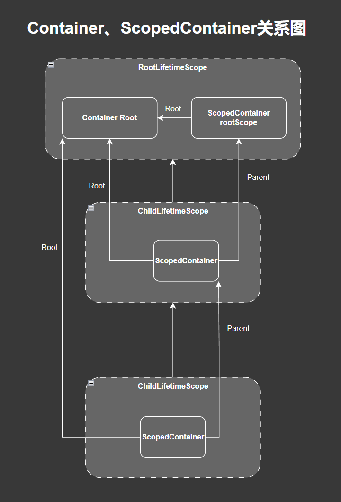
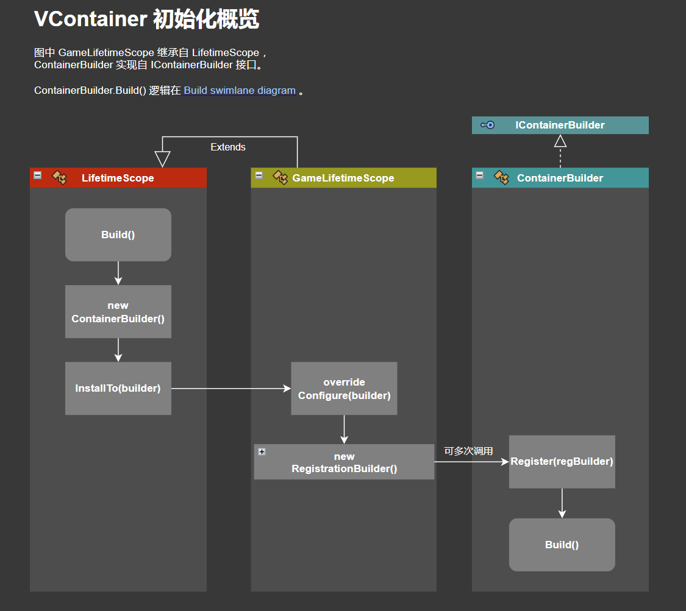
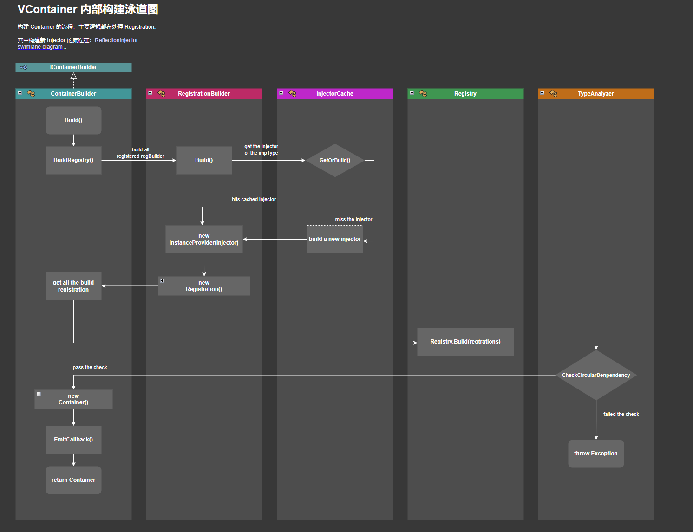
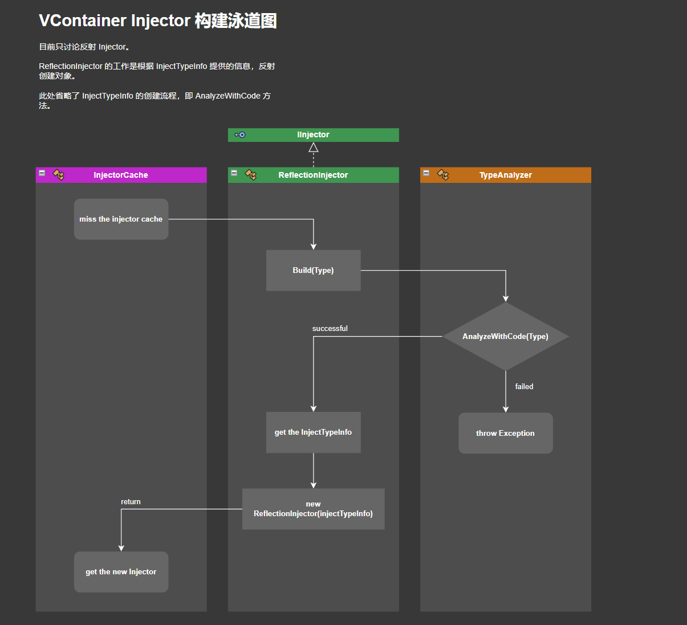
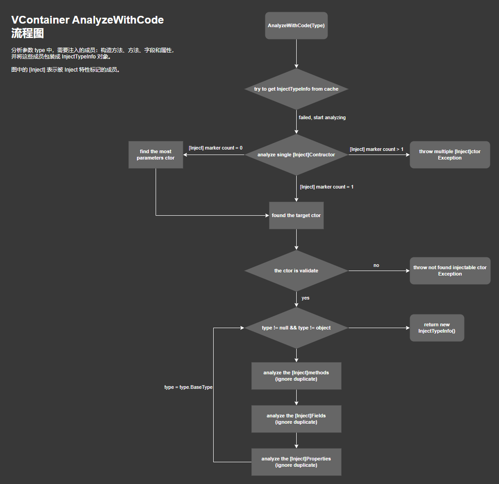
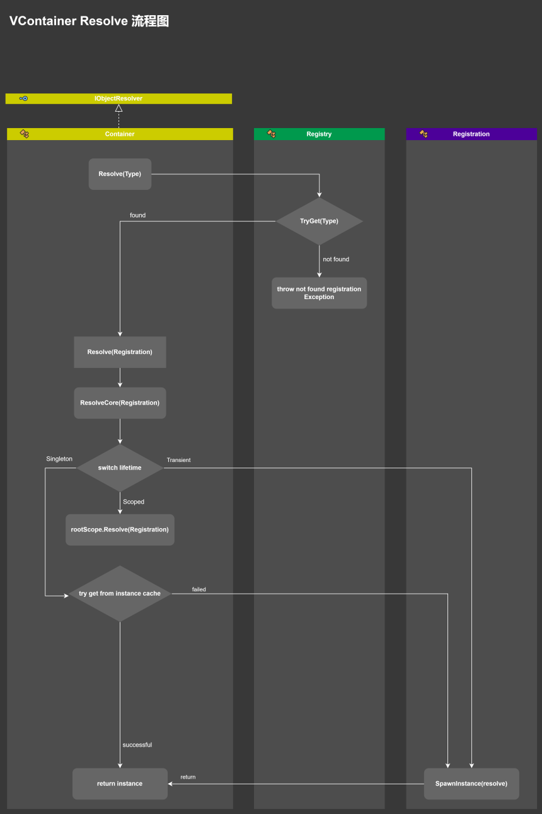
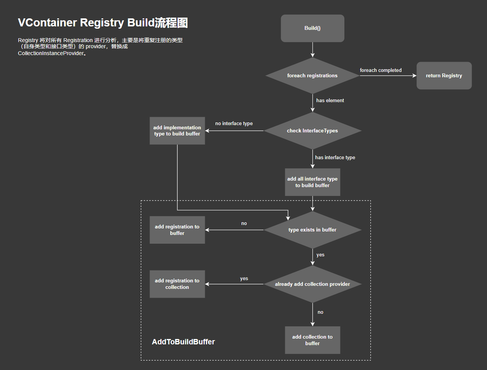

# SContainer

SContainer 是以学习 VContainer 而建立的教程仓库，[VContainer地址](https://github.com/hadashiA/VContainer)。

## 当前进度

| 分支         | 状态 | 备注                                      | 注册具体类型 | 注册接口 | 多重注册 | 子作用域 | EntryPoint | Unity适配 | 编辑器相关 |
| ------------ | ---- | ----------------------------------------- | ------------ | -------- | -------- | -------- | ---------- | --------- | ---------- |
| essential_v1 | 完成 | 仅包含最重要的组件，方便摸清库的实现逻辑  | ✔            | ❌        | ❌        | ❌        | ❌          | ❌         | ❌          |
| essential_v2 | 完成 | 能够注册接口，能够多重注册                | ✔            | ✔        | ✔        | ❌        | ❌          | ❌         | ❌          |
| essential_v3 | 完成 | 支持父-子作用域                           | ✔            | ✔        | ✔        | ✔        | ❌          | ❌         | ❌          |
| essential_v4 | 完成 | 支持EntryPoint                            | ✔            | ✔        | ✔        | ✔        | ✔          | ❌         | ❌          |
| essential_v5 | 完成 | 能够注册、解析 Mono 类等与Unity相关的功能 | ✔            | ✔        | ✔        | ✔        | ✔          | ✔         | ❌          |
| essential_v6 | 完成 | 引入配置文件（设置），检视窗口功能        | ✔            | ✔        | ✔        | ✔        | ✔          | ✔         | ✔          |

核心功能已经完成，后续不再开辟新的 essential 分支。新的扩展内容将提交至开发分支，并合并到主分支。

# 浅析Unity IoC容器——以VContainer库为参考

IoC容器是“控制反转”设计思想的具体实现，它提供“依赖注入”机制。当你想搭建一个灵活、可扩展的框架，就永远绕不开IoC容器这一话题。

如果你想了解为何要在Unity中使用IoC容器，其中的好处与代价，那么本文章或许能给你一些启发。在阅读本文章之前，强烈推荐先了解VContainer（[链接](https://github.com/hadashiA/VContainer/tree/master)）和它的[官方文档](https://vcontainer.hadashikick.jp/)，条件允许的话，你也可以浏览一下它的源代码。


## 再谈服务定位器

#### 基本概念

在《游戏编程模式》这本书中，介绍了一种解耦型模式——服务定位器。“为某服务提供一个全局访问入口来避免使用者与该服务具体实现类之间产生耦合”。我们之所以先讨论服务定位器，是因为该模式与依赖注入关系密切。让我们先暂时忘掉IoC容器，只着眼于服务定位器，看它如何让我们的代码变得低耦合。

《游戏编程模式》在讨论服务定位器时，有一个贯穿全文的例子：音频。它处于游戏业务的底层，且涉及了大量游戏系统：石块掉落到地面上，并发出撞击声（物理系统）；一个NPC狙击手开枪，会发出短促的枪声（AI系统）；用户选择一个菜单，并有一个确认的音效（用户交互系统）。

最简单的情况，我们会用如下代码去调用音频系统：

```c#
// 静态类
AudioSystem.PlaySound(soundId);

// 或者使用单例
AudioSystem.Instance.PlaySound(soundId);
```

我们完成了播放音效的功能，但同时引入了许多耦合。这些调用音频系统的地方，的确需要耦合到某些东西上以便播放声音，但直接耦合到音频具体实现类上就好像让一百个陌生人知道你家的地址，而仅仅是因为需要他们投递信件。这不仅是隐私问题，而是当你搬家时你必须告诉每个人你的新地址，这实在是太痛苦了。

这里有个更好的解决办法：电话簿。每一个想要联系我们的人能够通过查找名字来得到我们当前的地址。当我们搬家时，我们告诉电话公司，他们更新电话簿，这样每个人都能得到新的地址了。实际上，我们甚至不必给出我们真正的地址。我们能够列出一个邮政信箱，或者其他能够“代表”我们的东西。通过让访问者查询电话簿来找到我们，我们便有了一个方便的可以控制如何查找我们的方法。

上面的电话簿就是服务定位器。它的示例代码如下：

```c#
public interface IAudioService
{
    void PlaySound(int soundId);
}

public class AudioService : IAudioService
{
    public void PlaySound(int soundId)
    {
        // 播放声音资源
    }
}

public static class ServiceLocator
{
    private static readonly Dictionary<Type, object> services = new Dictionary<Type, object>();

    public static void RegisterService<T>(T service)
    {
        var type = typeof(T);
        if (services.ContainsKey(type))
        {
            services[type] = service;
        }
        else
        {
            services.Add(type, service);
        }
    }

    public static T GetService<T>()
    {
        var type = typeof(T);
        if (services.ContainsKey(type))
        {
            return (T)services[type];
        }
        else
        {
            // 抛出异常或返回空服务
        }
    }
```

它“定位”的方法十分简单——在使用这个服务之前它依赖一些外部代码来注册一个服务提供器。当游戏启动时，它调用类似下面的代码：

```c#
// 注册服务的具体实例
ServiceLocator.RegisterService<AudioService>(new AudioService());

// 或者注册服务接口
ServiceLocator.RegisterService<IAudioService>(new AudioService());
```

对于像音频系统这样实现了服务接口，且较为底层的服务，我们一般采用第二种注册服务接口的方式。调用`PlaySound()`的代码对`AudioService`的具体实现毫不知情。它只知道`IAudioService`抽象接口，重要的是，甚至定位器本身和具体服务提供器也没有耦合。代码中唯一知道具体实现类的地方，是提供这个服务的初始化代码。

#### 服务定位器模式的结构

1. **服务接口**：定义服务提供的功能。（IAudioService)
2. **服务提供器**（服务实现类）：实现服务接口的具体类。（AudioService）
3. **服务定位器**：维护服务实例的注册表，并提供访问这些实例的方法。（ServiceLocator）

#### 日志装饰器

为了体现该模式的优雅之处，《游戏编程模式》举了个例子来说明它——装饰的服务。

在开发中，事件日志能够让你估摸出游戏运行时发生了什么。如果你在开发AI系统，你很乐意知道一个单位的AI状态什么时候发生了变化。如果你是音频程序员，你可能想知道每次声音播放的记录，以便你能够检测其是否在正确的时候被触发。

如果调用一些`Log()`函数，那就用另一个问题代替了前一个问题——现在我们有太多日志了。AI程序员不关心什么时候播放声音，音频程序员不想知道AI状态的切换，但是现在他们都必须过滤各自的日志信息。

我们可以使用装饰器模式解决这个问题。让我们像这样定义另外一个音频服务提供器的实现：

```c#
public class LoggedAudioService : IAudioService
{
    private IAudioService wrapped;
    public LoggedAudioService(IAudioService wrapped)
    {
        this.wrapped = wrapped;
    }
    
    public void PlaySound(int soundId)
    {
        Debug.Log("播放声音");
        wrapped.PlaySound(soundId);
    }
}
```

它包装了另一个音频提供器并暴露了同样的接口。它将实际的音频操作转发给内嵌的服务提供器，但是它同时记录了每次音频调用。如果程序要开启音频日志，它可以这样调用代码：

```c#
// 原有的音频服务提供器
ServiceLocator.RegisterService<IAudioService>(new AudioService());
// 进行包装
IAudioService loggedAudioService = new LoggedAudioService(ServiceLocator.GetService<IAudioService>());
// 替换原有的提供器
ServiceLocator.RegisterService<IAudioService>(loggedAudioService);
```

#### 服务定位器就在我们身边

在不了解这个设计模式之前，“服务定位器”这个字眼对你来说可能十分抽象——什么被称为服务，什么时候需要定位。但如果你在开发工作上稍微有那么一点经验，那你肯定对"Managing Managers"这一设计模式略有耳闻。它至少有两个组成部分：

1. 管理器（Manager）：管理特定子系统或功能的对象，如音频管理器、输入管理器、资源管理器等。
2. 顶级管理器（Master Manager）：一个或多个高级管理器，负责协调和管理多个管理器。通常是一个。

管理器下还可以有子管理器，但这不在我们的讨论范围里了。它是一种设计模式，并且和服务定位器十分相似。比如我们的游戏有一个顶级管理器`GameManager`，同时我们还有音频管理器`AudioManager`。在游戏初始化阶段，我们顶级管理器会创建它负责的所有管理器。

```c#
class GameManager
{
    public IAudioManager AudioManager;
    public void Build()
    {
        AudioManager = new AudioManager();
        // 初始化其他管理器...
    }
}
```

在准备阶段，外部代码会调用`GameManager.Build()`来初始化管理器。之后，我们能通过顶级管理器访问音频管理器。

```c#
// ...游戏逻辑，需要播放声音资源
GameManager.Instance.AudioManager.PlaySound(soundId);
```

我们在这里把`GameManager`设置成了单例，你也可以将它修改成静态类。无论如何，只要你能像访问服务定位器那样，随时能访问顶级管理器就好，因为`GameManager`充当了服务定位器的角色。

你可以把”管理器模式“简单看成服务定位器模式的变体，这样或许能帮你更好理解后者的工作机制。我举这个例子，是因为”管理器模式“真的随处可见（无论是在互联网上的开发教程中，还是在真实的工作里）。如果你已经习惯并且熟练运用它，当你想要开发一个全新的系统时，要考虑的第一件事大概率是——我要不要新建一个管理器来装我的代码。

#### 使用的代价

- 全局变量：服务定位器通常能够全局访问。每当我们引入了全局变量，同时也引入了麻烦。和单例模式一样，这可能导致难以进行单元测试和并发问题。
- 隐藏依赖：服务定位器会将依赖关系隐含起来，阅读代码时比较难以理解依赖的是什么，增加了代码的复杂性和维护难度。
- 投资回报比：解耦的好处之一，是让多人合作开发变得顺利。在项目规模和人数保持平衡时，能最大程度体现这个模式的优势。如果一款游戏只有一两位程序员开发，那么它的回报会低于预期。


## 设计决策

了解服务定位器后，IoC容器已经呼之欲出了。IoC容器拥有服务定位器的功能，如果要实现它，我们需要针对一些核心问题进行讨论。

#### 服务是如何被定位的

- 外部代码注册

  这是我们在示例代码中用来定位服务的机制，同时这也是我在游戏中看到的最常见的设计。

  - （优点）它简单快捷，几乎没有性能损失。

  - （优点）我们控制提供器（Service）如何被构建。比如我们有一个在线游戏的服务提供器`NetService`，我们会从`NetService`处获取其他在线玩家的IP地址。如果定位器自己构建这个对象，它如何知道需要传递什么进去呢？定位器对在线情况一无所知，更何况其他用户的IP地址了。

    与其在定位器中构造这个类，不如在游戏的网络代码中实例化`NetService`，将它需要的IP地址传递进去。然后将它转给定位器，而定位器只知道这个服务的抽象接口。

  - （优点）我们可以在游戏运行的时候更换服务提供器。

  - （缺点）定位器依赖外部代码。访问服务的任何代码都假设这个服务已经被注册了。如果没有执行初始化，游戏要么崩溃，要么服务会神秘地无法工作。

- 在编译时绑定

  使用预编译处理宏，使得”定位“这个工作实际上发生在编译期：

  ```c#
  ServiceLocator.RegisterService<IAudioService>(new AudioService());
  
  #if ENABLE_LOGGED_AUDIO
  IAudioService loggedAudioService = new LoggedAudioService(ServiceLocator.GetService<IAudioService>());
  ServiceLocator.RegisterService<IAudioService>(loggedAudioService);
  #endif
  ```

  - （优点）很快！
  - （缺点）不能方便地更改服务提供器。任何更改服务的举动，都必须重新编译并重启游戏。

- 在运行时配置

  在企业级软件中，如果你说”服务定位器“，运行时配置就能立马浮现在开发工程师脑中。当服务被请求时，定位器通过一些运行时的操作来捕获被请求服务的真实实现。

  **通常来说，这表示加载一份配置文件来标识服务提供器，然后使用反射来在运行期实例化这个类。**

  - （优点）不需要重新编译就能切换服务提供器。
  - （优点）非程序员能够更换服务提供器。这在设计人员想要开关游戏的某项特性，但是不能够自信地摆弄代码时十分有用。你甚至可以开发一套UI操作面板，在上面编辑提供器的配置文件。
  - （优点）一份代码库能够同时支持多份配置。这在杂乱的移动设备上十分有用。
  - （缺点）这个方案比较复杂且十分重量级。你必须创建某个配置系统，很可能会写代码去加载解析文件，并通常做某些操作来定位服务。花在写这些代码上的时间就不能用来写别的游戏业务了。
  - （缺点）定位服务需要时间。使用运行时配置和反射意味着你在定位服务时消耗CPU周期。缓存能减缓这点，但是仍然意味着在你第一次使用这个服务的时候，游戏需要挂起花费时间来处理它。

#### 当服务不能被定位时会发生什么

- 让使用者处理

  最简单的解决办法是转移责任。如果定位器找不到服务，那它就返回NULL。使用者将决定当服务定位失败时，是否让游戏继续运行下去。但坏处是每处调用点必须返回是否为NULL，如果处理失败的方法都一样，就会在代码库中产生许多重复代码。

- 抛出异常

  ```c#
  public static T GetService<T>()
  {
      var type = typeof(T);
      if (services.ContainsKey(type))
      {
          return (T)services[type];
      }
      else
      {
          throw new Exception($"Service {typeof(T)} is not found"); // 抛出异常
      }
  }
  ```

  抛出异常的好处是能够快速发现bug，但在bug被修复前，这对任何人来说都是一个拖累，尤其存在于大型开发团队中。

- 返回一个空服务

  我们有一个空音频提供器，它相当于是默认的音频服务，除非有新的音频提供器注册进定位器里替换它。

  ```c#
  public class NullAudioService : IAudioService
  {
      public void PlaySound(int soundId)
      {
          // do nothing...
      }
  }
  ```

  空服务让使用者不需要处理丢失的服务，但它可能会让bug变得难以追踪。在大点的团队中，如果非常强调代码的健壮性，那么空服务是十分推荐的。

#### 服务的作用域

到目前为止，我们假设定位器为每个想要使用它的代码提供访问。这是这个模式典型的使用方式，另外一种选择是限制它的访问。

我们可以把代码划分为多个作用域，每个作用域拥有自己的服务定位器，通常定位器之间提供的服务是不同的。

全局访问鼓励整个代码库使用同一个服务，大部分服务都趋向独立。但我们对何时何地使用服务完全失去了控制。

作用域控制了耦合，但它可能导致重复的工作。


## VContainer会怎么做

VContainer的使用方式和服务定位器比较相似——用户编写服务（提供器），向容器注册服务，需要时向容器获取服务。容器取代了之前定位器的角色，这不仅仅是称呼上的转变，容器通常还提供更丰富的功能。

如果我们想将音频系统注册给VContainer，并在之后获取它，可以这样做：

```c#
ContaienrBuilder builder = new ContainerBuilder();
builder.Register<AudioService>(Lifetime.Singleton);
Container container = (Container)builder.Build();
AudioService audioService = container.Resolve<AudioService>();
```

我们没有直接把音频系统注册给`Container`，而是把注册工作移交给了`ContainerBuilder`。整个过程我们都没有显式创建`AudioService`，实例化由`Contaienr`内部完成。

#### 工作流程

VContainer通过外部代码来**注册**服务。与服务定位器模式不同，VContainer允许用户只提供被注册类的类型，而不用提供实例（当然，直接注册已有的实例也是可以的）。当代码运行到获取服务的地方，我们可以从VContainer处**解析**出服务的实例。

这样做的优点很明显，它做到了”懒加载“。只有当真正需要的时候，才会把服务实例加载到内存中，我们可以大胆地提前注册一些可能会用到的服务，而不用花费太大的代价。

缺点是我们需要为”懒加载“搭建一套注册和解析框架——VContainer已经帮我们做好了。如前文所说，这一套框架十分重量级。当用户注册一个类型时，我们必须分析它的元数据，并将其保存成**注册单（Registration）**，最后放进一张**注册表（Registry）**中。用户解析时，我们需要从注册表里查找注册单，根据注册单的信息，利用反射将这个类实例化然后返回（除了反射，VContainer还提供基于代码生成的解析方式）。由此可见，注册类型而不是实例仍然会有性能开销，但好在它是可控的。因为你无法每时每刻都知道，其他程序员会不会往容器里塞进一个不会被其他代码所引用的非常庞大的对象。

#### 核心结构

1. **ContainerBuilder**（容器构造器）：用于注册类型和构造容器。构造时会创建一张注入类型的注册表，并将它传给容器。
2. **Container**（容器）：外部代码通过它来获取实例，或主动将实例注入到需要的地方。内部维护一张注册表，当需要解析实例时，它会从注册表中查找注册单，再用注册单初始化实例。
3. **RegistrationBuilder**（注册单构造器）：是的，注册单也有构造器。除了纯C#类的类型，你还可以在VContainer中注册实例，Unity的组件，甚至是一个工厂方法。它们解析实例的方式各不相同，这需要RegistrationBuilder进行分析，并将解析方法告诉Registration。
4. **Registration**（注册单）：它知道怎么如何解析实例。一个注册单只负责解析一种实例。
5. **Registry**（注册表）：内部维护一张类型为键，注册单为值的哈希表，记录容器的所有注册单。
6. **LifetimeScope**（作用域）：VContainer拥有作用域类，每个作用域至少拥有一个Container。
7. **Entry Point**：提供纯C#代码的程序入口。

上面是VContaienr最核心的类，整个框架的骨干。我会稍用笔墨，以更好理解的顺序介绍它们。为了避免一开始就报菜名似的列出多到装不下的类和接口，我在这里省略了一些同样很重要的部分，但我们会在后面合适的时候谈论它们。

#### 作用域

作用域（LifetimeScope）处于VContainer框架的顶层位置，我们先来讨论它。VContainer鼓励使用LifetimeScope进一步降低代码的耦合。你可以通过几个关键词来快速了解它：

- MonoBehaviour：作为一个MonoBehaiour，LifetimeScope大多数情况下承担着程序入口的作用。LifetimeScope还能被保存为Prefab。
- Parent/Child：多个LifetimeScope之间可以建立父子关系。
- Container Binding：LifetimeScope初始化时，会自动创建一个Container与之绑定。如果这个LifetimeScope有指定的父节点，那么会自动成为父节点的子节点。

上面是我认为LifetimeScope最重要的几项属性，这意味着它的工作方式类似这样（伪代码）：

```c#
public class LifetimeScope : MonoBehaviour
{
	public Contaienr Container;
	public LifetimeScope Parent;
	protected virtual void Awake()
	{
    	Parent = GetRuntimeParent(); // 获取父节点（如果有）
    	if(Parent != null)
    	{
        	Contaienr = Parent.Container.CreateScope(builder => 
        	{
        		builder.Configure(builder); // 注册类型
        	});
    	}
    	else
    	{
        	ContainerBuilder builder = new ContainerBuilder();
        	builder.Configure(builder); // 注册类型
        	builder.Build(); // 构建注册表
    	}
	}
}

public class GameLifetimeScope : LifetimeScope
{
	public override Configre(ContainerBuilder builder)
	{
    	// builder.Regiser something here.
	}
}
```

我们会直接创建一个继承LifetimeScope的类来开辟一个新作用域，并重写`Configre()`直接注册类型。

#### 容器和生命周期

谈论Container之前，我们要先了解生命周期的概念。向Container注册的同时，我们必须提供被注册者的生命周期。有三种选择：

1. Singleton：被注册者为单例，整个父子关系链上的Contaienr都将返回同一个实例。
2. Transient：每次返回不同的实例。
3. Scoped：单个LifetimeScope的情况下，和单例类似。但如果LifetimeScope有子节点，那么不同子节点创建的实例将不同。当子节点被销毁，之前创建的实例也将被节点释放，要是实例实现了IDisposable接口，会调用`Dispose()`。

结合前面LifetimeScope的示例代码，你可能会意识到，父子关系不仅仅存在于LifetimeScope之间，容器也有。

当LifetimeScope有父节点时，我们利用父节点的Container提供的接口来创建其子孙Container。

实际上，VContainer中拥有两种Container和负责创建它们的ContainerBuilder：

- Container/ScopedContainer
- ContainerBuilder/ScopedContainerBuilder

当LifetimeScope没有父节点，那它会用ContainerBuilder创建Container，否则它的容器是ScopedContainerBuilder创建的ScopedContainer。下面我们简单谈谈它们的区别。

ScopedContaienrBuilder直接继承自ContainerBuilder，它们的关系是这样的：IContainerBuilder <--- ContainerBuilder <--- ScopedContainerBuilder。它们实现同一个接口，意味着ScopedContainerBuilder在功能上并没有大改动，不同之处只体现在它所创建的容器是ScopedContainer，而不是Container。

```c#
public class ContainerBuilder : IContainerBuilder
{
    public virtual Build()
    {
        // 构建注册表
        return new Container();
    }
}

public sealed class ScopedContainerBuild : ContainerBuilder
{
    public override Build()
    {
        // 构建注册表
        return new ScopedContainer();
    }
}
```

让我们把视角转到容器这边。Container实现接口IObjectResolver，而ScopedContainer的继承关系稍微有点不同：IObjectResolver <--- IScopedObjectResolver <--- ScopedContainer。

IScopedObjectResolver没有增加方法，只是简单增加了两项属性：

```c#
public interface IScopedObjectResolver : IObjectResolver
{
    IObjectResolver Root { get; }
    IScopedObjectResolver Parent { get; }
}
```

显然，它们为容器的父子关系服务。那么为什么不把它们直接塞进ScopedContainer，而是”大费周章“地使用接口？原因在于，在VContainer框架中，ScopedContainer偶尔需要担任相对独立的角色。为了实现Scoped生命周期相关的功能，它必须能在这方面独挑大梁。

Container初始化时，它会顺便创建一个ScopedContainer。如果外部代码请求生命周期为Scoped的实例时，Container会将工作交给ScopedContainer：

```c#
public sealed class Container : IObjectResolver
{
    private readonly Registry registry;
    private readonly IScopedObjectResolver rootScope;
    internal Container(Registry registry)
    {
        this.registry = registry;
        this.rootScope = new ScopedContainer(registry, this);
    }
    
    public object Resolve(Registration registration)
    {
        if(registration.Lifetime == Lifetime.Scoped)
        {
            this.rootScope.Resolve(registration);
        }
        
        // 处理其他生命周期注册单...
    }
}

public sealed class ScopedContainer : IScopedObjectResolver
{
    public IObjectResolver Root { get; }
    public IScopedObjectResolver Parent { get; }
    private readonly Registry registry;
    internal ScopedContainer(
        Registry registry, 
        IObjectResolver root, 
        IScopedObjectResolver parent == null)
    {
        this.registry = registry;
        this.Root = root;
        this.Parent = parent;
    }
    
    public object Resolve(Registration registration)
    {
        // 解析实例...
    }
}
```

Container和它创建的ScopedContainer拥有同一套注册表，你可能会对这一点略有疑惑。

首先，如果LifetimeScope没有父节点，那么它所属的容器当然是Container，它拥有自己的Registry，我们把它称作**根容器**。而为了实现Lifetime.Scoped的需求，我们有一条若干**域容器**组成的父子关系链需要维护。这些域容器也需要一个”域根“作为起始节点，而这个”域根“就由Container在构造方法里创建的ScopedContainer担任，这也是它的变量名rootScope代表的含义。同时这些域容器还持有根容器的引用。它们的关系图如下所示：



#### EntryPoint

为什么要在Unity中使用依赖注入？VContainer给出的理由是，降低游戏逻辑代码与MonoBehaviour之间的耦合。

MonoBehaviour是”视图组件“，但同时我们也在里面编写游戏逻辑代码——因为MonoBehaviour是代码的入口。将它们混在一起，显然不符合MVC模式的设计思想。不只是MVC模式，在现代程序设计中，都会强调逻辑和视图分而治之的重要性，MVC仅为其中的代表人物。

在我尝试在UGUI基础上开发第一套UI业务框架的时候，我的开发目的之一就是尽量减少MonoBehaviour的影响。我不能完全抛弃MonoBehaviour，Unity采用”更新方法模式“（Update Method Pattern）来提供游戏生命周期的访问接口，因此我还需要类似`Awake()`和`Update()`的接口来启用代码和访问游戏循环。

最简单的办法就是采用外部MonoBehaviour代理：

```c#
public interface ITick
{
    public void Update();
}

public class GameLoopSystem : MonoBehaviour
{
    private Dictionary<Type, ITick> ticks;
    public void Update()
    {
        foreach(var tick in ticks)
        {
            tick.Update();
        }
    }
}

public class UIObject : ITick
{
    public UIObject()
    {
        // 初始化工作...
    }
    
    // 初始化结束后由外部调用
    public void Start()
    {
        // 初始化结束后的逻辑...
    }
    
    public void ITick.Update()
    {
        // 游戏循环...
    }
}
```

我们在一定程度上达成了目的，但还不够优雅，至少存在两点问题：

1. 游戏逻辑代码和MonoBehaviour藕断丝连。
2. 游戏逻辑代码的`Start()`和`Update()`方法执行顺序可能不稳定，有”时序耦合“的风险。

好在Unity在2018.1版本后，开放了自定义PlayerLoopSystem接口。这使得我们可以在现有的循环系统中插入自己的生命周期回调，跟MonoBehaviour彻底说拜拜——事实上，VContainer就是这么做的。

VContainer提供了一系列接口（[接口文档链接](https://vcontainer.hadashikick.jp/integrations/entrypoint)），赋予我们代码以游戏的生命力。

```c#
public class GameLifetimeScope : LifetimeScope
{
	public override Configre(ContainerBuilder builder)
	{
    	builder.RegisterEntryPoint<FooController>();
	}
}

public class FooController : IStartable, ITickable
{
    public void IStarable.Start()
    {
        // Nearly MonoBehaviour.Start()
    }
    
    public void ITickable.Tick()
    {
        // Nearly MonoBehaviour.Update()
    }
}
```

FooController实现了生命周期接口`IStartable`和`ITickable`，被注册成EntryPoint。容器准备完毕后，就会自动初始化并调用接口方法。

注册EntryPoint的背后逻辑其实也比较简单。在第一次注册EntryPoint时，同时隐式注册了EntryPointDispatcher类。EntryPointDispatcher类内部的`Dispatch()`方法会在容器构建完毕的回调中调用。

```c#
public static void EnsureDispatcherRegistered(IContainerBuilder containerBuilder)
{
    if (containerBuilder.Exists(typeof(EntryPointDispatcher), false)) return;
    containerBuilder.Register<EntryPointDispatcher>(Lifetime.Scoped);
    containerBuilder.RegisterBuildCallback(container =>
    {
        container.Resolve<EntryPointDispatcher>().Dispatch();
    });
}
```

`Dispatch()`方法解析出容器内所有实现生命周期接口的实例，把接口方法委托给PlayerLoopunner。容器被销毁时，委托也会被释放。

#### 异常处理

VContainer遇到错误时，不会尝试修补，比如返回默认值，而是直接抛出VContainerException。如果你打算预先处理可能抛出的异常，可以使用try-catch语句捕获它。或者，你只想尝试解析某个实例，那么可以使用`IObjectResolver.TryResolver()`或者`IObjectResolver.ResolveOrDefault()`。

需要注意的是，EntryPoint相关的生命周期接口的方法里抛出的异常无法直接被捕获。但VContainer提供了EntryPointExceptionHandler类，让你不至于束手无策。EntryPointExceptionHandler是可选项，如果你不使用它，VContainer将把异常信息通过`UnityEngine.Debug.LogException()`打印出来。


## VContainer如何解析实例

我单独把VContainer背后跟解析相关的细节放在一个章节里——因为它值得。

#### 初始化



上图为初始化的大致流程图。LifetimeScope作为启动入口，根据是否有父节点判断采用哪种容器构造器——ContainerBuilder或ScopeContainerBuilder。然后调用虚方法`Configure()`，用户一般在这里注册。构造器对用户塞进来的RegistrationBuilder全盘收下，在执行完注册代码后，构造器将开始构造注册表和容器。

#### 内部构建流程



这里稍微复杂了一些。我们在这一步的目的是，构建好注册表Registry，并用它创建容器Container。这里有两个新朋友：

1. InjectorCache：Injector对象的缓存池。Injector对象是实现IInjector接口的实例，它们拥有创建实例和向实例注入依赖的功能。

   ```c#
   public interface IInjector
   {
       void Inject(object instance, IObjectResolver resolver, IReadOnlyList<IInjectParameter> parameters);
       object CreateInstance(IObjectResolver resolver, IReadOnlyList<IInjectParameter> parameters);
   }
   ```

   VContainer提供两种Injector，除了默认的反射Injector，还有基于代码生成技术的Injector，后者的执行效率更高。我们目前只讨论反射Injector。

   在图中，Injector被传给InstanceProvider，而InstanceProvider又会传给Registration。也就是说，当需要Registration解析实例时，它是经过一层层向下请求，最终由Injector将实例创建出来并返回给它的。这是最普通的情况，VContainer里还有继承Registration的子类，以及InstanceProvider的变体（同样实现IInstanceProvider接口的类）。虽然它们各自有扩展出来的不同功能，但只要围绕焦点进行分析，很快就能弄明白它们在做什么。

2. TypeAnalyzer：这个类负责的功能集中在分析类型元数据上。它在这里承担了分析是否有循环依赖的工作。当A类依赖B类，并且B类也依赖A类，那么程序就陷入了死锁，这是必须要排除掉的安全隐患。

#### Injector如何被构建



我们来聊一下Injector的构建过程，因为这里又有新面孔：InjectTypeInfo。平时如果我们想用反射创建一个实例，只需要知道这个实例的Type即可。但VContainer还需要把依赖注入进实例，因此只拿到Type还不够，我们还需要对实例的构造方法、普通方法、属性和字段进行分析。

InjectTypeInfo就保存着这些信息，里面包含着实例的注入点，这样我们既能把实例创建出来，还能把它依赖的对象注入进去。

#### InjectTypeInfo的创建流程



流程比较清晰，处理构造方法可分为前半部分，剩下的普通方法、属性、字段为后半部分。

代码会首先选取被[Inject]标记的构造方法，如果没有被标记的，则选择参数最多的构造方法。不允许出现一个以上被[Inject]标记的构造方法。

普通方法、属性、字段，只用判断它们是否被[Inject]标记即可，被标记的就是注入点。考虑到分析的类型可能继承自其他类，因此在注入的时候，也要把父类中被[Inject]标记的注入点给记录下来。当然，重复的注入点直接跳过就好。

#### Container解析流程



有了前面的铺垫，Container的解析就变得比较好理解了。

解析请求传来时，首先去注册表里查找注册单，找到后根据注册的类型进行解析。

Transient类型最简单，因为它不需要考虑生命周期和作用域，直接命令注册单创建实例。

其次是Singleton，我们添加了缓存来提高后续的解析速度。

最后是Scoped，我们将派遣顶级“域容器”rootScoped来接替工作。关于“根容器”和“域容器”，我们在前面的“容器与生命周期”小节已经讨论过了。

#### Registry构建的细节



我们还有最后一张图没有看！注册表的构建代码其实还别有洞天。

从图中可知，Registry在遍历时，会优先检查用户有没有把类型注册成接口。有的话就要注意了，Registry只会把接口添加进哈希表中，这意味着请求解析时，只能请求接口，而不能请求实现接口的类型。

```c#
// 注册接口
builder.Register<AudioService>(Lifetime.Singleton).As<IAudioService>();
var container = builder.Build();

// 解析接口，允许
var audio = container.Resolve<IAudioService>();

// 解析具体类型，不允许
var audio = container.Resolve<AudioService>();
```

如果你想两种解析都能通过，可以在注册时使用`AsSelf()`。

```c#
builder.Register<AudioService>(Lifetime.Singleton).As<IAudioService>().AsSelf();
```

VContainer源码中，把当前注册单的所有接口都放进哈希表后，还是会把接口的具体类型也添加进去，只不过它只有Key，没有Registration与之建立关系。

```c#
// Mark the implementationType with a guard because we need to check if it exists later.
if (!buildBuffer.ContainsKey(registration.ImplementationType))
{
    buildBuffer.Add(registration.ImplementationType, null);
}
```

只放接口进哈希表，是为了降低耦合度，但如果彻底抛弃实现接口的本尊，那么容器根本不知道我们添加了什么——举个例子，没有具体类型，我们就无法判断循环依赖是否存在。因此我们还是悄悄地将它放进哈希表，这只是为了方便我们开展后续工作，用户并不清楚。有时候，变通一下能让世界变得更美好。

图中虚线框出来的部分，重点是解决多重注册的问题。有时候，用户会注册相同的接口。

```c#
builder.Register<Monster>(Lifetime.Transient).As<ICharacter>();
builder.Register<Boss>(Lifetime.Transient).As<ICharacter>();
var container = builder.Build();

// 允许，Monster和Boss都将被解析
container.Resolve<IEnumerable<ICharacter>>();
```

刚开始，我们可能只注册了Mosnter，后来我们开发了Boss，我们不想修改之前的注册代码，而是添加新代码，VContainer会把多次注册的类型添加进数组中，供我们一次把他们全解析出来。

## 结语

到此，我们围绕Unity IoC容器的讨论已经结束了。我没有列举太多的代码，也没有深入讨论VContainer的技术细节，因为我发现，最快的学习方法，还得是阅读源码。而我希望这篇文章，能帮助你更好地理解VContainer的设计思路，在你学习源码的路上，助你一臂之力。
